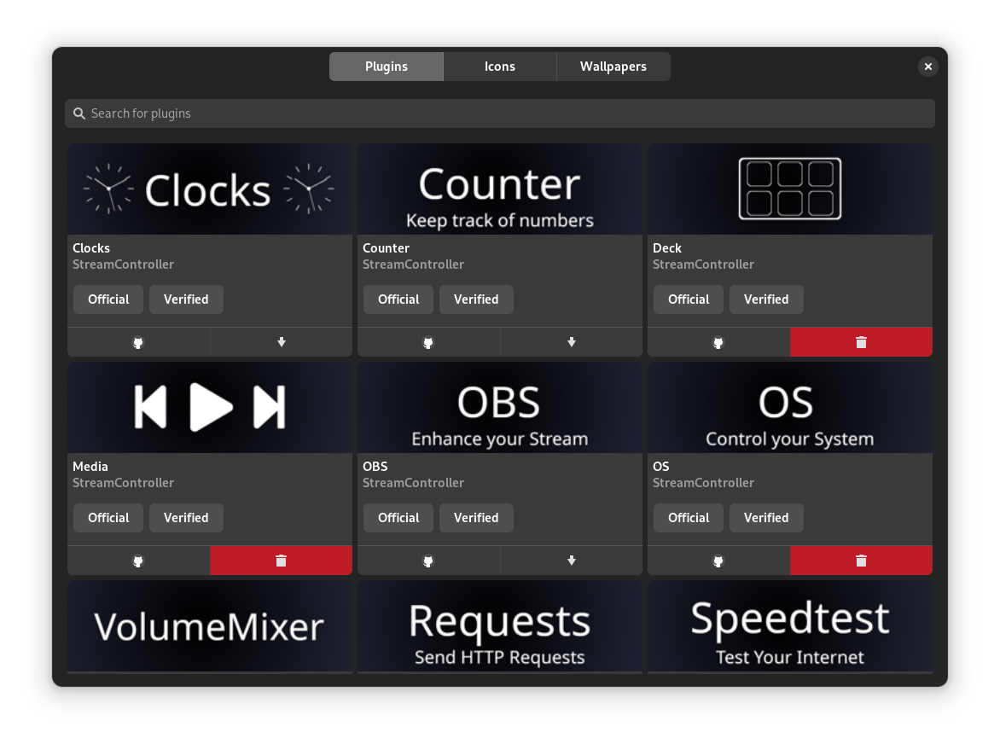

# StreamController - The Linux app for the Elgato Stream Deck

<figure markdown="span">
  {loading=lazy}
  <figcaption>Background image by <a href="https://www.artstation.com/kvacm">kvacm</a></figcaption>
</figure>

## Features
- Plugin support
- Icon pack support
- Wallpaper pack support
- Multi deck support
- Background images & videos
- Automatic page switching based on the active window
- Auto-lock feature that locks the Stream Deck when the system is locked
- Option to configure deck rotation
- Nice GTK4 interface
- Active maintenance

## Gallery

  
  

  
  

  
  

  
  

  Background images by <a href="https://www.artstation.com/kvacm">kvacm</a>

