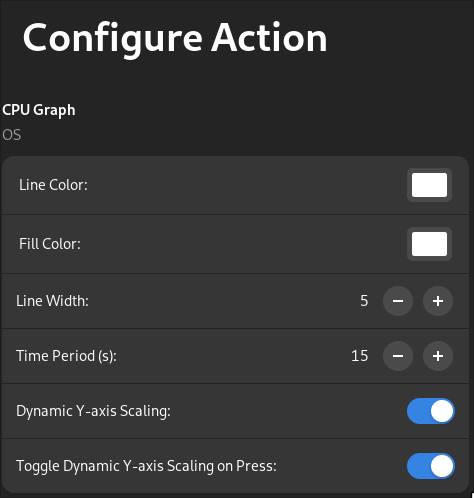

The [ActionCore](ActionCore_py.md) is the base class for all actions in [StreamController](https://github.com/StreamController/StreamController). All your actions must extend this class.

ActionCore provides access to the key/dial/touchscreen controlled by your action and offers methods to change images, set labels, handle events, and manage settings.

If you want to learn more by going through the code, click [here](https://github.com/StreamController/StreamController/blob/main/src/backend/PluginManager/ActionCore.py).

## Quick Start

```python
from src.backend.PluginManager.ActionCore import ActionCore
from src.backend.PluginManager.EventAssigner import EventAssigner
from src.backend.DeckManagement.InputIdentifier import Input

class MyAction(ActionCore):
    def __init__(self, *args, **kwargs):
        super().__init__(*args, **kwargs)
        
        # Register event handlers
        self.add_event_assigner(EventAssigner(
            id="key-down",
            ui_label="Key Down",
            default_event=Input.Key.Events.DOWN,
            callback=self.on_key_down
        ))
    
    def on_ready(self):
        self.set_media(media_path=self.get_asset_path("icon.png"))
    
    def on_key_down(self):
        print("Key pressed!")
```

See [Event System](EventSystem.md) for more details on registering event handlers.

## Properties

### `has_configuration`
: **Type**: `bool`  
  **Default**: `False`

    Set to `True` to enable the configuration UI for this action. When enabled, the action will show a settings panel when selected.

### `allow_event_configuration`
: **Type**: `bool`  
  **Default**: `True`

    Set to `False` to prevent users from remapping events for this action in the UI.

### `event_manager`
: **Type**: `EventManager`

    The event manager for this action. Use `add_event_assigner()` to register event handlers. See [Event System](EventSystem.md) for details.

## Lifecycle Methods

### `on_ready`
: This method is called when the page is ready to process requests made by actions.

    !!! info
        Always set your default image in `on_ready()`, not in `__init__()`. The deck is not ready to process image changes during construction.

    ```python
    def on_ready(self):
        icon_path = self.get_asset_path("icon.png")
        self.set_media(media_path=icon_path)
    ```

### `on_update`
: This method is called when the app wants the action to redraw itself (image, labels, etc.).

    By default, this calls `on_ready()` for backwards compatibility. Override to customize refresh behavior.

### `on_tick`
: This method gets called **every second** to allow live updates to the key.

    !!! warning
        Unlike event callbacks, all actions on the same deck execute ticks in the same thread. Do **not** add time-consuming code here. The next tick loop starts one second after the last one finished, so delays will accumulate.

    ```python
    def on_tick(self):
        # Update a clock display
        self.set_center_label(time.strftime("%H:%M:%S"))
    ```

### `on_remove`
: Called when the action is fully removed from the page. Use this to clean up resources.

### `on_removed_from_cache`
: Called when the action is removed from the page cache. Use this for cache-related cleanup.

### `on_backend_ready`
: Called when the RPyC backend connection is established. Override this to perform initialization that requires the backend.

## Visual Methods

### `set_media`
: **Arguments**:

    |Argument|Default|Description|Type|
    |---|---|---|---|
    |image|None|A PIL Image to display|[PIL.Image.Image](https://pillow.readthedocs.io/en/stable/reference/Image.html)|
    |media_path|None|Path to an image, video, or gif file|str|
    |size|None|Scale factor for the image (1.0 = full size)|float|
    |valign|None|Vertical alignment (-1 to 1, 0 = center)|float|
    |halign|None|Horizontal alignment (-1 to 1, 0 = center)|float|
    |fps|30|Frames per second for video playback|int|
    |loop|True|Whether to loop video playback|bool|
    |update|True|Whether to immediately update the display|bool|

    **Description**:  
    Sets the content of the key. Supports images, videos, and gifs.

    ```python
    # Using a file path
    self.set_media(media_path=self.get_asset_path("icon.png"), size=0.75)
    
    # Using a PIL Image
    from PIL import Image
    img = Image.new("RGB", (72, 72), color="red")
    self.set_media(image=img)
    ```

### `set_background_color`
: **Arguments**:

    |Argument|Default|Description|Type|
    |---|---|---|---|
    |color|[0, 0, 0, 0]|RGBA color values (0-255)|list[int]|
    |update|True|Whether to immediately update the display|bool|

    ```python
    self.set_background_color([255, 0, 0, 255])  # Red background
    ```

### `set_label`
: **Arguments**:

    |Argument|Default|Description|Type|
    |---|---|---|---|
    |text|None|The text to display|str|
    |position|"bottom"|One of: `top`, `center`, `bottom`|str|
    |color|None|RGB color values (0-255)|list[int]|
    |font_family|None|Font family name|str|
    |font_size|None|Font size in points|int|
    |outline_width|None|Text outline width|int|
    |outline_color|None|RGB color for outline|list[int]|
    |font_weight|None|Font weight (e.g., 400, 700)|int|
    |font_style|None|One of: `normal`, `italic`, `oblique`|str|
    |update|True|Whether to immediately update the display|bool|

    **Description**:  
    Writes text in one of three positions on the key.

    ```python
    self.set_label("Hello", position="center", color=[255, 255, 255])
    ```

### `set_top_label`
: Convenience method equivalent to `set_label(..., position="top")`.

### `set_center_label`
: Convenience method equivalent to `set_label(..., position="center")`.

### `set_bottom_label`
: Convenience method equivalent to `set_label(..., position="bottom")`.

### `show_error`
: **Arguments**:

    |Argument|Default|Description|Type|
    |---|---|---|---|
    |duration|-1|Duration in seconds (-1 = infinite)|int|

    **Description**:  
    Shows an error indicator on the key. Useful for indicating backend failures or invalid states.

    ```python
    try:
        result = self.backend.do_something()
    except Exception as e:
        self.show_error(duration=3)
    ```

### `hide_error`
: Hides the error indicator shown by `show_error()`.

### `show_overlay`
: **Arguments**:

    |Argument|Default|Description|Type|
    |---|---|---|---|
    |image|None|PIL Image to overlay|[PIL.Image.Image](https://pillow.readthedocs.io/en/stable/reference/Image.html)|
    |duration|-1|Duration in seconds (-1 = infinite)|int|

    **Description**:  
    Shows an overlay image on top of the current key content.

### `hide_overlay`
: Hides the overlay shown by `show_overlay()`.

## Configuration Methods

### `get_config_rows`
: **Returns**: `list[Adw.PreferencesRow]`

    Override this method to provide configuration rows in the UI.

    <figure markdown>
    {width="300" align=left loading=lazy}
    <figcaption>Example from the [OS Plugin](https://github.com/StreamController/OSPlugin)</figcaption>
    </figure>

    ```python
    def get_config_rows(self) -> list:
        spinner = Adw.SpinRow.new_with_range(1, 100, 1)
        spinner.set_title("Increment by")
        return [spinner]
    ```

    !!! tip
        Consider using [GenerativeUI](GenerativeUI.md) widgets instead of manual GTK widgets. They automatically handle saving and loading settings.

### `get_custom_config_area`
: **Returns**: `Gtk.Widget` or `None`

    Override this method to provide a fully custom configuration area. This allows any GTK widget, giving complete control over the config UI.

    !!! info
        For GTK tutorials, check out [GTK4 Python Tutorial](https://github.com/Taiko2k/GTK4PythonTutorial) or the [GTK4 documentation](https://docs.gtk.org/gtk4/).

### `get_settings`
: **Returns**: `dict`

    Returns the settings dictionary for this action. Settings are stored in the page JSON and persist across restarts.

    ```python
    settings = self.get_settings()
    value = settings.get("my_key", "default_value")
    ```

### `set_settings`
: **Arguments**:

    |Argument|Description|Type|
    |---|---|---|
    |settings|Dictionary of settings to store|dict|

    **Description**:  
    Stores settings for this action. The dict is written directly into the page JSON.

    ```python
    settings = self.get_settings()
    settings["my_key"] = "new_value"
    self.set_settings(settings)
    ```

    The settings appear in the page JSON like this:
    ```json
    "actions": [
        {
            "name": "com_example_MyPlugin::MyAction",
            "settings": {
                "my_key": "new_value"
            }
        }
    ]
    ```

## Event Methods

### `add_event_assigner`
: **Arguments**:

    |Argument|Description|Type|
    |---|---|---|
    |event_assigner|The event assigner to register|[EventAssigner](EventSystem.md)|

    **Description**:  
    Registers an event handler for this action. See [Event System](EventSystem.md) for details.

    ```python
    from src.backend.PluginManager.EventAssigner import EventAssigner
    from src.backend.DeckManagement.InputIdentifier import Input

    self.add_event_assigner(EventAssigner(
        id="my-action",
        ui_label="Do Something",
        default_event=Input.Key.Events.DOWN,
        callback=self.do_something
    ))
    ```

## Asset Methods

### `get_asset_path`
: **Arguments**:

    |Argument|Default|Description|Type|
    |---|---|---|---|
    |asset_name|None|Name of the asset file|str|
    |subdirs|None|List of subdirectories|list[str]|
    |asset_folder|"assets"|Name of the assets folder|str|

    **Returns**: `str` - Full path to the asset

    ```python
    icon_path = self.get_asset_path("icon.png")
    # Returns: /path/to/plugin/assets/icon.png
    
    icon_path = self.get_asset_path("play.png", subdirs=["icons"])
    # Returns: /path/to/plugin/assets/icons/play.png
    ```

### `get_icon`
: **Arguments**:

    |Argument|Default|Description|Type|
    |---|---|---|---|
    |key|None|Icon key registered with plugin|str|
    |skip_override|False|Skip user overrides|bool|

    **Returns**: `Icon` or `None`

    Gets an icon registered with the plugin's asset manager.

### `get_color`
: **Arguments**:

    |Argument|Default|Description|Type|
    |---|---|---|---|
    |key|None|Color key registered with plugin|str|
    |skip_override|False|Skip user overrides|bool|

    **Returns**: `Color` or `None`

    Gets a color registered with the plugin's asset manager.

### `get_translation`
: **Arguments**:

    |Argument|Default|Description|Type|
    |---|---|---|---|
    |key|None|Translation key|str|
    |fallback|None|Fallback if key not found|str|

    **Returns**: `str`

    Gets a localized string from the plugin's locale manager.

    ```python
    title = self.get_translation("action.title", "Default Title")
    ```

## Backend Methods

### `launch_backend`
: **Arguments**:

    |Argument|Default|Description|Type|
    |---|---|---|---|
    |backend_path|None|Path to the backend Python file|str|
    |venv_path|None|Path to a virtual environment|str|
    |open_in_terminal|False|Open backend in terminal (for debugging)|bool|

    **Description**:  
    Launches a local backend process. The backend communicates with the action via RPyC.

    !!! warning
        This method blocks until the backend is registered. For plugin-wide backends, use `PluginBase.launch_backend()` instead.

    ```python
    backend_path = os.path.join(self.plugin_base.PATH, "backend", "backend.py")
    self.launch_backend(backend_path=backend_path)
    ```

    After launching, access the backend via `self.backend`:
    ```python
    result = self.backend.some_method()
    ```

    See [BackendBase](BackendBase_py.md) for backend implementation details.

## Utility Methods

### `get_is_multi_action`
: **Returns**: `bool`

    Returns `True` if this action is part of a multi-action setup (multiple actions on the same key). When `True`, image operations should generally be disabled.

### `get_is_present`
: **Returns**: `bool`

    Returns `True` if this action is currently visible on the active page.

### `connect`
: **Arguments**:

    |Argument|Default|Description|Type|
    |---|---|---|---|
    |signal|None|The signal to connect to|[Signal](../advanced_concepts/Signals.md)|
    |callback|None|Callback function|callable|

    **Description**:  
    Connects to application signals for responding to UI events like page renames.

    ```python
    from src.Signals import Signals
    
    self.connect(signal=Signals.PageRename, callback=self.on_page_rename)
    ```

    See [Signals](../advanced_concepts/Signals.md) for available signals.
