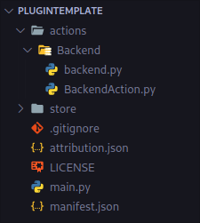

# Get the Template Running

In the [previous step](../setup.md) you copied the [plugin template](https://github.com/StreamController/PluginTemplate) into your plugins folder and renamed it. Before we change anything, let's look at what's inside and get it running.

## What's in the template



You'll touch these files most:

| File | What it's for |
|---|---|
| `main.py` | The entry point. It registers your actions with StreamController. |
| `actions/SimpleAction/SimpleAction.py` | An example action — the thing that sits on a button. |
| `manifest.json` | Your plugin's identity (name, id, version). |
| `assets/` | Images your plugin ships, like the example `info.png`. |

Don't worry about the rest yet — we'll meet each file when we need it.

## Run it

With StreamController running from source (see [Set Up Your Environment](../setup.md)) and at least one [FakeDeck enabled](../key_concepts.md#how-youll-test):

1. Open StreamController.
2. Click an empty key to open the action picker.
3. Find your plugin's **Simple Action** and add it.

You should see the example **info** icon appear on the key. Press the key — and watch your terminal:

```
Pressed
```

That's it: a working action, drawing an image and reacting to a press. In the next steps we'll take this apart to understand *how* it works, then extend it.

!!! tip "Not showing up?"
    Make sure the plugin folder is inside your data `plugins` directory and that you launched StreamController with the `--data data` argument from the [setup step](../setup.md). Errors usually appear in the terminal you started StreamController from.

Next: let's look at how the action [draws its icon](SimpleAction_py.md).
